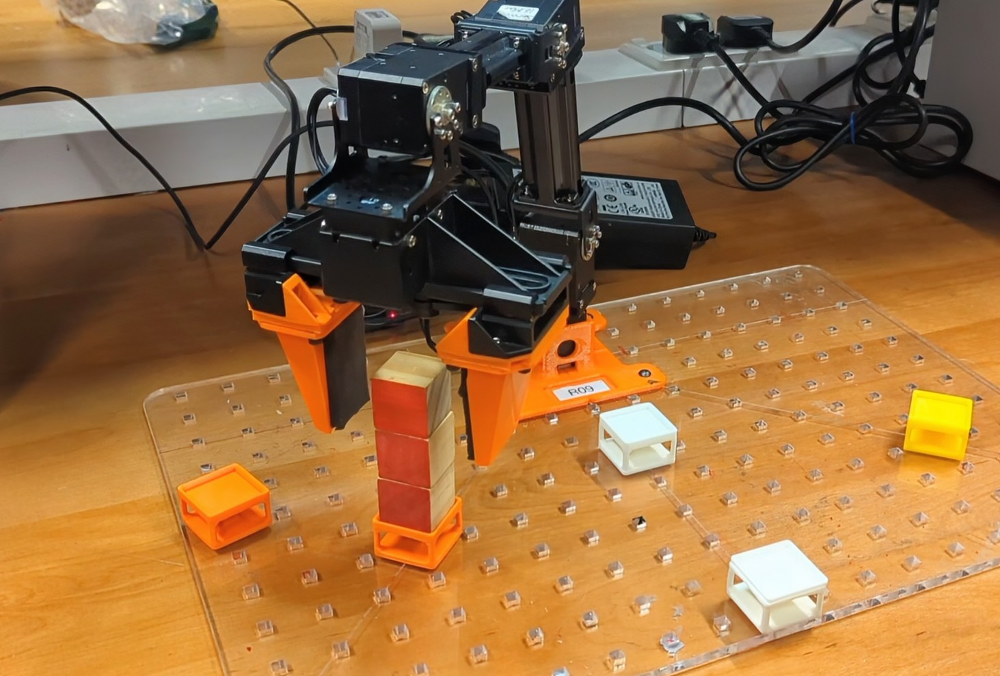

# ELEC60030 - Robotic Manipulation Coursework 2024

This repository contains the code for the Robotic Manipulation coursework, which consists of four tasks:

1. **Model the robot**:
   - Assign coordinate frames to the robot and create a DH notation table.
   - Create a graphical simulation of the robot based on the DH table.
   - Determine a solution to the inverse kinematics for a frame located between the jaws of the gripper.
   - Re-run the simulation with inverse kinematics, tracing squares in each Cartesian plane.

2. **Pick and Place**:
   - Pick up wooden cubes from starting locations and transfer them to finishing locations.
   - Pick up cubes with specific red face orientations, rotate them, and place them back in the same location.
   - Stack cubes in a finishing location, with all red faces facing away from the robot.

3. **Trajectory Following (Drawing)**:
   - Design and 3D print a method to securely hold a pen with the robot.
   - Draw a pattern involving straight lines (horizontal, vertical, and diagonal) and a partial circle (270-degree arc with constant radius).

4. **Own Task**:
   - Come up with an original, challenging, and motivated robot manipulation task.
   - Execute the task with the robot, demonstrating the knowledge learned during the course.
   - Use physical props to make the task more realistic, while considering the robot's size and baseplate holes for positioning.

 

Detailed instructions for each task and the evaluation criteria can be found in the [coursework PDF](docs/Robotic%20Manipulation%20Coursework%202024.pdf).

---

 

 
   